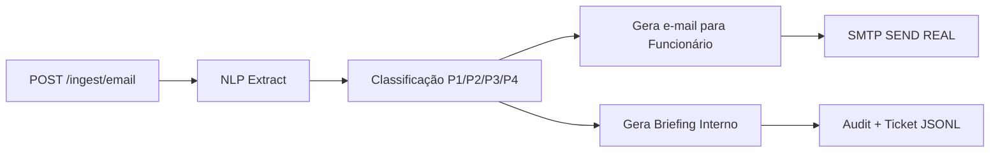

# 🧠 MentalHealth Shield — POC

### Automação Inteligente para Triagem de Solicitações de Saúde Mental

[](https://www.python.org/)
[](https://fastapi.tiangolo.com/)
[](LICENSE)

> Trabalho acadêmico desenvolvido para FIAP — Global Solution (Graduação)

**Desenvolvido por:**
- Guilherme Almeida
- Vitor Adauto
- Matheus Barbosa

---

## 📋 Sobre o Projeto

O **MentalHealth Shield** é uma prova de conceito (POC) que demonstra como a automação inteligente pode auxiliar no processo de triagem de solicitações relacionadas à saúde mental em ambientes corporativos.

### 🎯 Funcionalidades

- ✉️ Recebimento e processamento de e-mails de colaboradores
- 🔍 Análise de texto com NLP (implementação simplificada via regex)
- 🎚️ Classificação automática de urgência (P1 → P4)
- 💬 Geração de respostas empáticas automáticas
- 🎫 Criação de tickets internos
- 📧 Envio de e-mails reais via SMTP (Gmail)

---

## 🏗️ Arquitetura



---

## ✅ Status da POC

| Etapa | Resultado |
|-------|-----------|
| FastAPI rodando local | ✅ |
| NLP básico funcionando | ✅ |
| Classificação P1–P4 | ✅ |
| Geração de texto de resposta | ✅ |
| Envio real via SMTP Gmail | ✅ |
| Audit + Tickets em JSONL | ✅ |

---

## 🚀 Como Rodar

### 1️⃣ Instalar Dependências

```bash
pip install -r requirements.txt
pip install email-validator
```

### 2️⃣ Configurar Variáveis de Ambiente

Use `.env.example` como modelo e crie seu arquivo `.env`:

#### Para usar Gmail:

1. Ativar autenticação de dois fatores (2FA) na sua conta Google
2. Gerar App Password em: https://myaccount.google.com/apppasswords
3. Usar essa senha no campo `SMTP_PASS` do arquivo `.env`

> ⚠️ **IMPORTANTE:** NÃO subir o arquivo `.env` no GitHub!

### 3️⃣ Iniciar a API

```bash
uvicorn app.main:app --reload
```

### 4️⃣ Testar no Navegador

Acesse a documentação interativa da API:
- **Swagger UI:** http://127.0.0.1:8000/docs
- **Endpoint principal:** `POST /ingest/email`

---

## 📂 Estrutura de Saídas

| Local | Descrição |
|-------|-----------|
| `data/tickets.jsonl` | Tickets internos simulados |
| `data/audit.jsonl` | Logs e erros SMTP |
| Retorno do endpoint | Preview do e-mail e classificação de prioridade |

---

## 📁 Estrutura do Projeto

```
MentalHealth-Shield/
├── app/
│   ├── main.py
│   └── ...
├── data/
│   ├── tickets.jsonl
│   └── audit.jsonl
├── .env.example
├── requirements.txt
└── README.md
```

---

## 🤝 Contribuindo

Este é um projeto acadêmico. Sugestões e melhorias são bem-vindas!

---

## 📄 Licença

Este projeto foi desenvolvido para fins educacionais como parte do programa Global Solution da FIAP.

---

## 📞 Contato

Para dúvidas sobre o projeto, entre em contato com os autores através da instituição FIAP.

---

<p align="center">
  Feito com 💙 para a FIAP Global Solution
</p>