# 🧠 MentalHealth Shield — POC

### Automação Inteligente para Triagem de Solicitações de Saúde Mental

[](https://www.python.org/)
[](https://fastapi.tiangolo.com/)
[](LICENSE)


> Trabalho acadêmico desenvolvido para FIAP — Global Solution (Graduação)

**Desenvolvido por:**
- Guilherme Almeida
- Vitor Adauto
- Matheus Barbosa

---

## 📋 Sobre o Projeto

O **MentalHealth Shield** é uma prova de conceito (POC) que demonstra como a automação inteligente pode auxiliar no processo de triagem de solicitações relacionadas à saúde mental em ambientes corporativos.

### 🎯 Funcionalidades

- ✉️ Recebimento e processamento de e-mails de colaboradores
- 🔍 Análise de texto com NLP (implementação simplificada via regex)
- 🎚️ Classificação automática de urgência (P1 → P4)
- 💬 Geração de respostas empáticas automáticas
- 🎫 Criação de tickets internos
- 📧 Envio de e-mails reais via SMTP (Gmail)

### 🧱 Stack Utilizada

| Tecnologia | Uso |
|-----------|-----|
| Python 3.11+ | Runtime principal |
| FastAPI | Exposição da API REST |
| Regex-based NLP | Extração e classificação de texto |
| Gmail SMTP (App Password) | Envio real de e-mails |
| JSONL | Persistência de tickets e auditoria |
| Pydantic | Validação de dados |

---

## 🏗️ Arquitetura

```mermaid
flowchart LR
    A[POST /ingest/email] --> B[NLP Extract]
    B --> C[Classificação P1/P2/P3/P4]
    C --> D[Gera e-mail para Funcionário]
    C --> E[Gera Briefing Interno]
    D --> F[SMTP SEND REAL]
    E --> G[Audit + Ticket JSONL]
```



**Diagrama Alternativo (ASCII):**
```
┌─────────────────┐
│ POST /ingest    │
│    /email       │
└────────┬────────┘
         │
         ▼
┌─────────────────┐
│   NLP Extract   │
│  (Regex-based)  │
└────────┬────────┘
         │
         ▼
┌─────────────────┐
│ Classificação   │
│  P1 / P2 / P3   │
│      / P4       │
└────┬───────┬────┘
     │       │
     ▼       ▼
┌─────────┐ ┌──────────────┐
│ E-mail  │ │   Briefing   │
│Empático │ │   Interno    │
└────┬────┘ └──────┬───────┘
     │             │
     ▼             ▼
┌─────────┐ ┌──────────────┐
│  SMTP   │ │ Audit +      │
│  SEND   │ │ Ticket JSONL │
└─────────┘ └──────────────┘
```

---

## 📧 Exemplo de Resposta Real

> Preview do e-mail **REAL** enviado pela API via Gmail SMTP

<p align="center">
  
</p>

*💡 O sistema gera automaticamente respostas empáticas personalizadas baseadas na classificação de urgência.*

---

## ✅ Status da POC

| Etapa | Resultado |
|-------|-----------|
| FastAPI rodando local | ✅ |
| NLP básico funcionando | ✅ |
| Classificação P1–P4 | ✅ |
| Geração de texto de resposta | ✅ |
| Envio real via SMTP Gmail | ✅ |
| Audit + Tickets em JSONL | ✅ |

---

## 🚀 Como Rodar

### 1️⃣ Instalar Dependências

```bash
pip install -r requirements.txt
pip install email-validator
```

### 2️⃣ Configurar Variáveis de Ambiente

Use `.env.example` como modelo e crie seu arquivo `.env`:

#### Para usar Gmail:

1. Ativar autenticação de dois fatores (2FA) na sua conta Google
2. Gerar App Password em: https://myaccount.google.com/apppasswords
3. Usar essa senha no campo `SMTP_PASS` do arquivo `.env`

> ⚠️ **IMPORTANTE:** NÃO subir o arquivo `.env` no GitHub!

### 3️⃣ Iniciar a API

```bash
uvicorn app.main:app --reload
```

### 4️⃣ Testar no Navegador

Acesse a documentação interativa da API:
- **Swagger UI:** http://127.0.0.1:8000/docs
- **Endpoint principal:** `POST /ingest/email`

---

## 📂 Estrutura de Saídas

| Local | Descrição |
|-------|-----------|
| `data/tickets.jsonl` | Tickets internos simulados |
| `data/audit.jsonl` | Logs e erros SMTP |
| Retorno do endpoint | Preview do e-mail e classificação de prioridade |

---

## 📁 Estrutura do Projeto

```
MentalHealth-Shield/
├── app/
│   ├── main.py
│   └── ...
├── data/
│   ├── tickets.jsonl
│   └── audit.jsonl
├── docs/
│   └── email_example.png
├── .env.example
├── requirements.txt
└── README.md
```

---

## 🗺️ Roadmap Futuro

Possíveis evoluções para versões futuras:

- [ ] Integração com modelos de NLP avançados (BERT, GPT)
- [ ] Dashboard web para visualização de métricas
- [ ] Sistema de notificações via WhatsApp/Telegram
- [ ] Machine Learning para melhorar classificação de urgência
- [ ] Integração com sistemas de RH corporativos
- [ ] Suporte multi-idioma
- [ ] API de feedback para refinamento do modelo

---

## 🤝 Contribuindo

Este é um projeto acadêmico. Sugestões e melhorias são bem-vindas!

---

## 📄 Licença

Este projeto foi desenvolvido para fins educacionais como parte do programa Global Solution da FIAP.

---

## 📞 Contato

Para dúvidas sobre o projeto, entre em contato com os autores através da instituição FIAP.

---

<p align="center">
  Feito com 💙 para a FIAP Global Solution
</p>